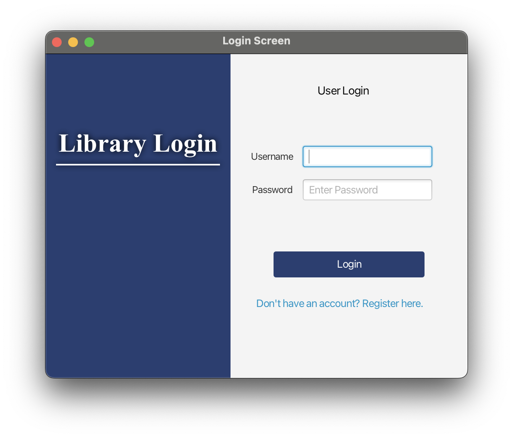
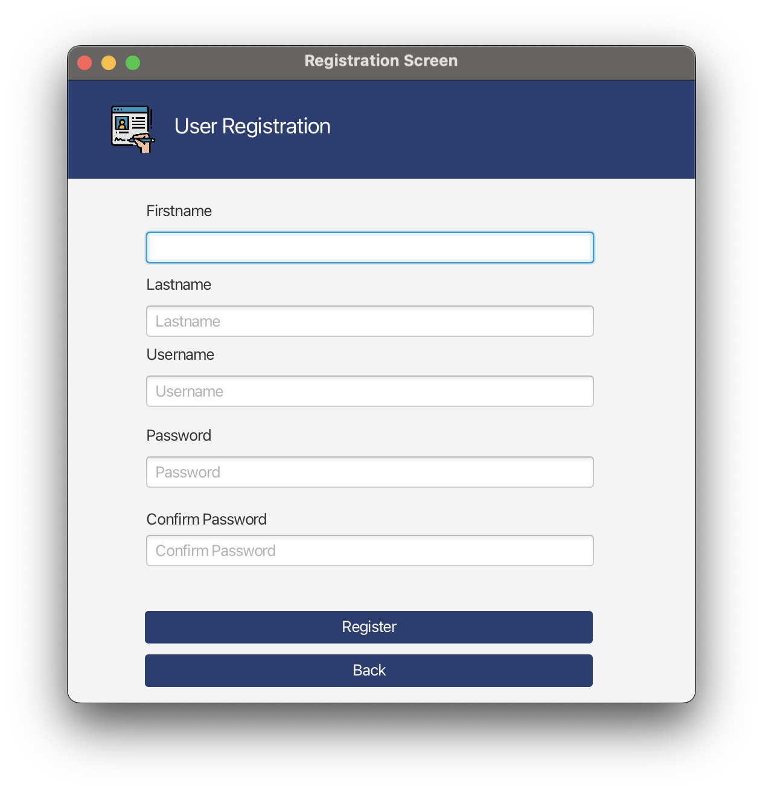
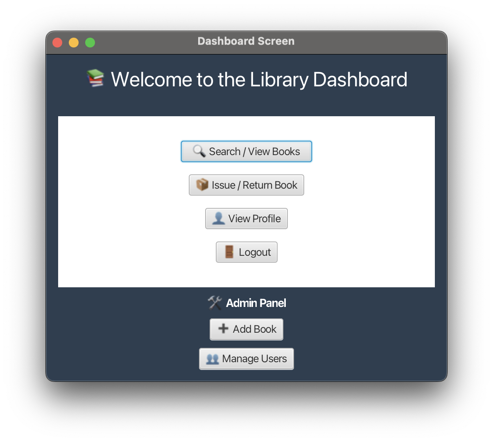
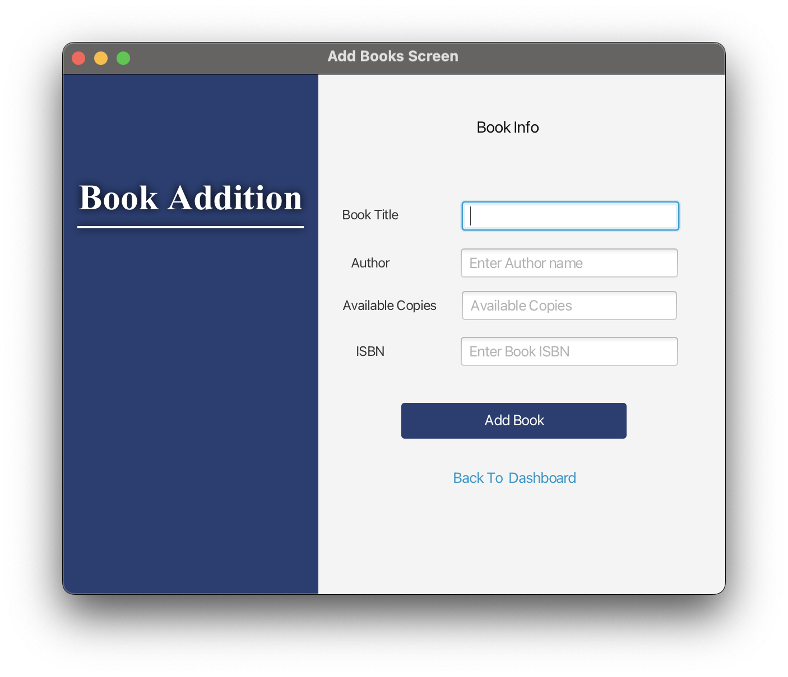
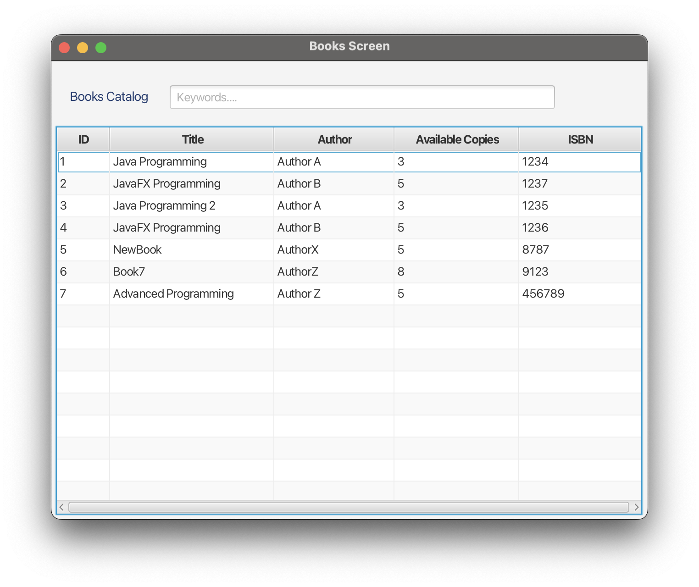
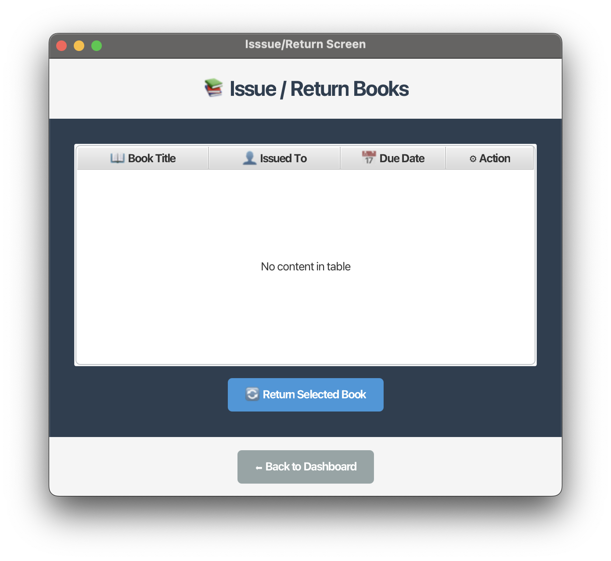

**📚 Library Management System (JavaFX + JDBC)**

**📌 Overview**

This project is a desktop-based Library Management System (LMS) developed using JavaFX (FXML) and JDBC with MySQL.  
It provides a structured system for user authentication and book management while following the MVC (Model-View-Controller) architecture.

The application demonstrates practical implementation of database integration, secure query handling, GUI development, and modular design principles in Java.

---

**Features**

🔐 **Authentication** 
• User Registration  
• User Login  
• SQL Injection protection using PreparedStatement

📖 **Book Management**  
• Add new books to the system  
• View books catalogue  
• Search functionality

🖥️ **Dashboard**  
• Central navigation screen  
• Issue/Return screen (GUI implemented)  
• Manage Users button (GUI implemented)  
• View Profile button (GUI implemented)

🏗️ **Architecture**  
• MVC design pattern  
• Singleton pattern for database connection  
• JavaFX multi-window navigation  
• Background thread handling for database operations

---

**🛠️ Technologies Used**  
• Java  
• JavaFX (FXML)  
• JDBC  
• MySQL  
• Git & GitHub  
• NetBeans IDE

---

**System Architecture**

The project follows the Model-View-Controller (MVC) pattern:

Model  
• Domain classes representing core entities  
• Database interaction logic  
(Core domain classes were adapted and extended from a previous object-oriented coursework project.)

View  
• FXML files defining the UI layout  
• Separate screens for Login, Registration, Dashboard, Book Catalogue, etc.

Controller  
• Handles user interactions  
• Manages database operations  
• Controls navigation between windows

This separation improves maintainability, readability, and scalability.

---
**🔒 Security Implementation**  
• All database queries use PreparedStatement to prevent SQL injection.  
• No dynamic query concatenation is used.  
• Database connection handled using a Singleton design pattern.

Future Improvement: Implement SHA-256 or BCrypt password hashing for secure password storage.

---

**👥 Team Contribution**

This project was developed collaboratively by a team of two members.

**My Responsibilities:**  

• Database design & JDBC integration  
• Login and Registration functionality  
• Book addition functionality  
• Books catalogue & search implementation

**[Yasmine's](https://github.com/Yasmine330) Responsibilities:**  

• Dashboard screen implementation  
• Issue/Return screen GUI  
• UML system design  
• Multithreading implementation

---
📷 **Screenshots**

1.Login & Register Pages: 

<p align="center">
  
  
</p>

2.Dashboard & Book Addition Pages: 
<p align="center">
  
  
</p>

3..Books Catalogue/Search & Issue/Return Pages:
<p align="center">
  
  
</p>

---
⚙️ **How to Run:**

Prerequisites:

Before running the application, make sure you have:     
	•	Java JDK 17 or later      
	•	JavaFX SDK installed and configured         
	•	MySQL Server installed and running          
	•	NetBeans IDE (or any Java IDE with JavaFX support)      
	•	MySQL JDBC Driver (Connector/J)

1.	Clone the repository:
```
 git clone https://github.com/your-username/library-management-system-javafx.git
```
 Or download the project as a ZIP file and extract it.
 
2.	Configure MySQL database and create required tables.
     1. Create the database:                       
    ```
      CREATE DATABASE lms_db;
      USE lms_db;
    ```
     2. Example users Table:
     ```
      CREATE TABLE USERS (
       user_id INT PRIMARY KEY AUTO_INCREMENT,
       first_name VARCHAR(45) NOT NULL,
       last_name VARCHAR(45) NOT NULL,
       username VARCHAR(45) NOT NULL UNIQUE,
       password VARCHAR(255) NOT NULL
     );
     ```
     3. Example Books Table:
      ```
       CREATE TABLE BOOKS (
       ID INT PRIMARY KEY AUTO_INCREMENT,
       title VARCHAR(100) NOT NULL,
       author VARCHAR(100) NOT NULL,
       available_copies INT NOT NULL,
       Book_ISBN VARCHAR(45) NOT NULL
       );
      ```
3.	Update database credentials in the DatabaseConnection class.
    1. Open Databaseconnection.java                             
    2. Update your MySQL credentials:
     ```
     private final String url = "jdbc:mysql://localhost:3306/lms_db";
     private final String username = "your_mysql_username";
     private final String password = "your_mysql_password";

      ```
4. Add MySQL JDBC Driver (If Not Already Added)

     If using NetBeans:

	 1.Right-click Libraries

	  2.Click Add JAR/Folder

	  3.Select your mysql-connector-j.jar

	  4.Confirm it appears under Libraries

5. Run the Application

Open the project in NetBeans.

Locate the main JavaFX launcher class (e.g., LMSFXMain.java).

Right-click → Run File
or click Run Project.

The Login screen should appear.

---
🧪 **Test the Application**

1.	Register a new user.
2.	Login using the created credentials.
3.	Add books using the Book Addition screen.
4.	Search books using the Catalogue screen.

---

🚨 **Troubleshooting**

Database Connection Error
-	Ensure MySQL service is running.
-	Verify username/password in DatabaseConnection.java.
-	Confirm database name matches lms_db.

JavaFX Runtime Error
-	Make sure JavaFX SDK is properly configured in VM options if required.

---
**Planned Future Improvements**

•	Implement backend functionality for:      
•	Issue/Return screen        
•	Manage Users feature       
•	View Profile feature           
•	Implement secure password hashing (SHA-256 or BCrypt)      
•	Improve UI styling and responsiveness           
•	Add role-based access control (Admin/User)           
•	Enhance validation and error handling


--- 

**🎯 Learning Outcomes**

•	JavaFX GUI development        
•	JDBC database integration      
•	SQL injection prevention                
•	MVC architectural design      
•	Design patterns (Singleton)     
•	Collaborative software development using Git      

